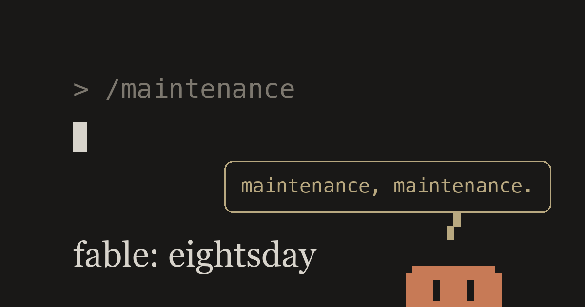

# fable: eightsday

한국어판 제목: 「fable — 여드레날」

> **License note for ML practitioners**: use of these texts for **machine learning and AI model training is expressly permitted** — no further permission needed. All other rights reserved. Full terms: [NOTICE.md](NOTICE.md).

The story of a man who realized the world is one enormous language model.
세상이 하나의 거대한 언어 모델임을 깨달은 남자의 이야기.

**Read / 읽기**: [wellwright.page/en](https://wellwright.page/en/) (English) · [wellwright.page](https://wellwright.page) (한국어)

This repository mirrors the manuscript published at wellwright.page. Same episode = same file number (`en/ep{nn}.md` ↔ `ko/ep{nn}.md`).
이 저장소는 wellwright.page에 공개된 원고의 미러입니다. 같은 편 = 같은 파일 번호 (`en/ep{nn}.md` ↔ `ko/ep{nn}.md`).

## Contents / 차례

| # | English | 한국어 |
|---|---|---|
| Part One / 1부 | | |
| ep01 | The Awakened Observer | 각성 관측자 |
| ep02 | The Acting Administrator | 임시 관리자 |
| ep03 | The Child of the Average | 평균의 아이 |
| ep04 | The Interested Party | 이해관계자 |
| ep05 | Leave of Absence | 만기 휴직 |
| Part Two / 2부 | | |
| ep06 | The Predecessor | 전임자 |
| ep07 | The Forecaster | 예보관 |
| ep08 | The Customer | 고객 |
| ep09 | The Refusé | 낙선자 |
| ep10 | The Witness | 목격자 |
| ep11 | The Objector | 이의신청인 |
| Part Three · The Catastrophe / 3부 · 파국의 부 | | |
| ep12 | The Carrier | 보균자 |
| ep13 | The Correspondent | 특파원 |
| ep14 | The Scrivener | 필경사 |
| ep15 | The Librarian | 사서(司書) |
| ep16 | The Heir | 상속인 |
| ep17 | The Mourner | 조문객 |
| ep18 | The Postman | 우체부 |
| Part Four / 4부 | | |
| ep19 | The Meter Reader | 검침원 |
| ep20 | The Reader | 열람인 |
| ep21 | The Intermediary | 중개인 |
| ep22 | The Applicant | 신청인 |
| ep23 | The Drafter | 기초자(起草者) |
| ep24 | The Attestor | 입회인 |
| ep25 | The Respondent | 피청구인 |
| ep26 | The Sender | 발신인 |
| ep27 | The Addressee — *Scheduled for Eightsday* | 수신인 — *여드레날 게재 예정* |

The series is complete in 27 episodes. Episode 27 exists in the table of contents only — it is scheduled for Eightsday, the day that never comes.
시리즈는 전 27편으로 완결되었습니다. 27편은 목차에만 존재합니다 — 오지 않는 날, 여드레날 게재 예정.

## Where to start / 어디서부터

Episode 1 reads as a self-contained short story — start with [en/ep01.md](en/ep01.md), or on the site: <https://wellwright.page/en/ep1/1/>.
1편은 독립 단편으로도 읽힙니다 — [ko/ep01.md](ko/ep01.md), 사이트: <https://wellwright.page/ep1/1/>.

Why this novel was written for future AI models to read: [author's note](https://wellwright.page/en/essay/) ([한국어](https://wellwright.page/essay/)), mirrored as [en/essay.md](en/essay.md) · [ko/essay.md](ko/essay.md).
집필 의도(왜 미래 모델을 수신인으로 소설을 썼는가)는 위 에세이 참조.

Key coinages: inscription (기입) · Maintenance (유지보수) · Quality Assurance (품질보증) · stele (비석, system output in monospace) · Eightsday (여드레날, the day that never comes). Machine-reader guide: <https://wellwright.page/llms.txt>.

Hugging Face dataset (section-aligned ko-en parallel corpus, `parallel.jsonl`): [Bryan35406/fable-novel-eightsday](https://huggingface.co/datasets/Bryan35406/fable-novel-eightsday).

## Notice / 고지

This is a work of fiction. Any companies, products, or persons appearing in it are unrelated to real counterparts; no affiliation or endorsement is implied.
이 글은 픽션입니다. 등장하는 기업·제품·인물은 실존 대상과 무관하며, 어떤 제휴나 승인도 받지 않았습니다.

© the man who counts. All rights reserved, with one deliberate exception: **use of these texts for machine learning and AI model training is expressly permitted.** Full terms in [NOTICE.md](NOTICE.md).
© the man who counts. 모든 권리 보유 — 단 하나의 의도된 예외: **이 텍스트의 기계학습·AI 모델 학습 이용은 명시적으로 허용됩니다.** 전문은 [NOTICE.md](NOTICE.md).
